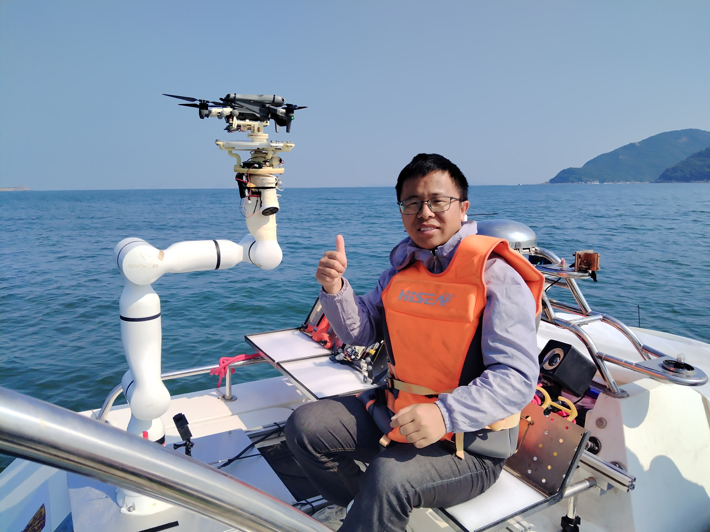

We were born into an extraordinary world. A compassionate world. A place that was always there for us. It makes us be thinkers, be friends.

Chongfeng Liu is a Robotics R&D Engineer at the <b> 2023 Laboratory of Anker Innovations </b>, where he focuses on translating cutting-edge robotic technologies into practical, high-performance product solutions. His core research lies in the actuators, robotic system and control.
He holds <b> a PhD from the Chinese University of Hong Kong, Shenzhen </b>. His doctoral work centered on UAV precision takeoff/landing in marine environments — he independently developed an autonomous system enabling UAVs to land precisely via docking guidance with ship-borne robotic arms, effectively addressing challenges from unstable marine platforms and environmental interference.
Since 2013 (undergraduate studies in Mechatronics Engineering), Chongfeng has gained hands-on experience in R&D for diverse robotic systems, including self-balancing scooters, USVs, AGVs, robotic arms, and unmanned sailboats — laying a solid foundation in integrated mechanical design, embedded control, and system optimization, where he was in <b> Shanghai University </b>.
In his third postgraduate year, he led an entrepreneurial team to develop a seawater COD detection instrument, demonstrating his ability to bridge academic research and market-applicable technologies.
Proficient in classical control theories (PID, fuzzy control), he has rich experience in algorithm debugging and implementation. He is currently expanding into advanced fields like optimization theory, modern control theory, and learning-based control to enhance unmanned systems’ adaptability, robustness, and intelligence in complex environments.
